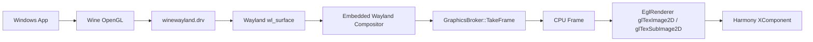
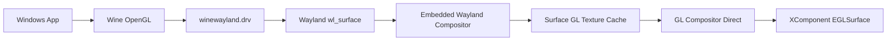
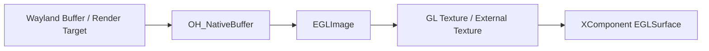
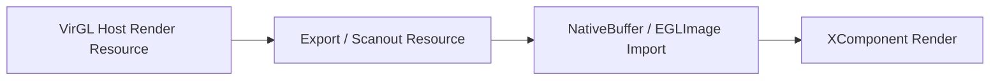

# Wine + VirGL 显示链路优化与前端兼容性改造指导

> 适用场景：当前 OpenGL / VirGL Step 1 已跑通，但最终显示仍走 `wl_shm + cpu_copy + gl_upload`，希望在不推翻现有 Wine / Wayland / XComponent 架构的前提下，减少数据拷贝，并提高 ArkTS 前端兼容性。  
> 建议用途：可作为 Codex 编码任务说明、技术方案评审文档、后续 Step 2 / Step 3 路线依据。  
> 更新时间：2026-06-27

---

## 1. 背景与当前状态

当前方案已经完成 Step 1：Wine 内 OpenGL 程序可以在 HarmonyOS PC emulator 上正确出图。

当前 3D 命令路径：

```text
Windows App OpenGL
  -> Wine opengl32 / win32u / winewayland.drv
  -> guest Mesa virpipe
  -> vtest socket
  -> virgl_test_server
  -> virglrenderer
  -> host EGL / GLES
```

当前最终显示路径：

```text
Wine Wayland wl_surface
  -> embedded Wayland compositor
  -> GraphicsBroker::TakeFrame
  -> EglRenderer glTexImage2D / glTexSubImage2D
  -> Harmony XComponent
```

当前主要问题：

```text
当前显示传输模式仍是：
wl_shm + cpu_copy + gl_upload

也就是说：
1. Wayland surface 内容先进入 wl_shm。
2. embedded compositor 再把画面取成 CPU frame。
3. EglRenderer 再把 CPU frame 上传成 GL texture。
4. 最后渲染到 XComponent。
```

这个状态说明：

- VirGL 命令路径已经接通。
- 但最终显示链路还不是零拷贝。
- 当前性能瓶颈优先在最终显示路径，而不是 guest OpenGL 命令路径。
- 优化应从 `TakeFrame -> CPU full frame -> gl upload` 这一段开始。

---

## 2. 总体目标

### 2.1 核心目标

在保持现有可运行状态的前提下，逐步优化显示链路：

```text
当前：
wl_shm + cpu_copy + gl_upload

短期目标：
wl_shm + GL texture cache + GL compositor direct to XComponent

中期目标：
NativeBuffer / EGLImage import，减少 shm 到 GL 的上传成本

长期目标：
VirGL resource / scanout import，接近零拷贝显示
```

### 2.2 非目标

当前阶段不建议直接追求以下目标：

- 一步实现完整零拷贝。
- 一开始就做多窗口专项支持。
- 一开始就重写 Wine OpenGL driver。
- 一开始就强依赖 dmabuf。
- 一开始就把 DXVK / Vulkan 作为主验证路径。

原因：

- 当前最重要的是保持已经跑通的 OpenGL Step 1。
- HarmonyOS 侧 NativeBuffer / EGLImage / dmabuf 能力边界需要逐项验证。
- vtest + virglrenderer 并不等同于完整 virtio-gpu scanout 管线。
- 过早追零拷贝容易把问题复杂化，反而破坏当前可运行状态。

---

## 3. 推荐架构演进

### 3.1 当前架构



当前缺点：

- `TakeFrame()` 会生成整帧 CPU 图像。
- `EglRenderer` 又把整帧 CPU 图像上传到 GL。
- 即使画面局部变化，也可能整屏上传。
- CPU、内存带宽、GPU 上传都有额外开销。
- 前端容易被底层显示模式绑死。

---

### 3.2 短期推荐架构：GL Compositor Direct



核心变化：

```text
不再把 compositor 输出成整屏 CPU frame。
而是让 compositor 直接把各个 wl_surface 对应的 texture 合成到 XComponent 的 EGLSurface。
```

这个阶段仍然可能存在：

```text
wl_shm -> glTexSubImage2D
```

但可以去掉：

```text
compositor -> CPU full frame -> EglRenderer 再上传
```

这是当前性价比最高、风险最低的优化。

---

### 3.3 中期架构：NativeBuffer / EGLImage



目标：

- 尝试使用 HarmonyOS / OpenHarmony 的 NativeBuffer 相关能力。
- 验证 NativeBuffer 是否可以被 EGLImage 导入。
- 验证 EGLImage 是否可以作为 GL texture 采样。
- 如果可行，进一步替代部分 wl_shm 上传路径。

注意：

```text
不要默认假设 Linux dmabuf 在 Harmony 应用侧完整可用。
需要逐项验证平台能力、权限、fd 传递、同步 fence 和 EGL 扩展。
```

---

### 3.4 长期架构：VirGL Resource / Scanout Import



目标：

- 尝试让 virglrenderer 的 host render resource 直接进入显示链路。
- 尽量绕过 Wayland shm。
- 达到接近零拷贝的显示效果。

风险：

- 当前 vtest server 不是完整 virtio-gpu scanout 管线。
- 可能需要 fork / 改造 `virgl_test_server`。
- 可能需要新增 resource export / import 逻辑。
- 可能受限于 OHOS 图形内存导入能力。

因此这条线只建议作为 Step 3 或 Step 4，不建议当前主攻。

---

## 4. 核心改造原则

### 4.1 保留现有路径作为 fallback

当前 `wl_shm + TakeFrame + gl_upload` 虽然性能不是最优，但它已经能跑通。

因此不能直接删除，应改造成 fallback：

```text
CpuShmPresenter
```

用途：

- 老设备兼容。
- 图形能力探测失败时兜底。
- 截图 / 调试。
- 对比性能数据。
- smoke exe 回归验证。

---

### 4.2 显示路径抽象为 IFramePresenter

建议新增：

```cpp
enum class FramePath {
    CpuShmUpload,        // 现有路径，兜底
    GlCompositorDirect,  // 短期主路径
    NativeBufferImport,  // 中期目标
    VirglScanoutImport   // 长期目标
};

class IFramePresenter {
public:
    virtual ~IFramePresenter() = default;

    virtual bool Init() = 0;
    virtual bool Resize(int width, int height) = 0;
    virtual bool Present() = 0;
    virtual void Destroy() = 0;

    virtual FramePath Path() const = 0;
    virtual const GraphicsStats& GetStats() const = 0;
};
```

然后实现：

```text
CpuShmPresenter
GlCompositorPresenter
NativeBufferPresenter   // 后续
VirglScanoutPresenter   // 后续
```

---

### 4.3 不要让 ArkTS 前端感知底层 backend

ArkTS / XComponent 前端只应该面对统一的 session 接口。

建议前端只保留：

```ts
startGame(config)
pauseGame()
resumeGame()
resize(width, height, dpr)
setInputMode(mode)
setScaleMode(mode)
sendPointerEvent(event)
sendKeyEvent(event)
setVirtualMouse(enabled)
setFrameLimit(fps)
stopGame()
```

不要在 ArkTS 前端写：

```text
if virgl
if shm
if nativebuffer
if vulkan
if dxvk
```

这些判断应该全部放在 Native 侧。

---

### 4.4 Backend 自动探测和自动降级

Native 侧可以维护：

```cpp
enum class GraphicsBackend {
    Auto,
    Shm,
    Virgl,
    NativeBuffer,
    Vulkan
};

struct BackendCaps {
    bool virglAvailable;
    bool xcomponentEglAvailable;
    bool glCompositorAvailable;
    bool nativeBufferAvailable;
    bool eglImageAvailable;
    bool dmaBufAvailable;
};
```

启动时按顺序探测：

```text
1. XComponent EGLSurface 是否可用
2. VirGL socket 是否可用
3. guest_gfx / Mesa virpipe 是否可用
4. GL compositor direct 是否可用
5. NativeBuffer / EGLImage 是否可用
6. 失败则 fallback 到 CpuShmPresenter
```

日志必须明确输出：

```text
graphics_backend=virgl
presenter=gl_compositor_direct
zero_copy=false
damage_upload=true
native_buffer=false
fallback=false
```

---

## 5. 短期重点任务：GL Compositor Direct

### 5.1 目标

把当前路径：

```text
Wayland compositor
  -> TakeFrame
  -> CPU full frame
  -> EglRenderer upload
  -> XComponent
```

改成：

```text
Wayland compositor
  -> surface texture cache
  -> GL compositor
  -> XComponent EGLSurface
```

### 5.2 需要新增的核心类

建议新增或重构为：

```text
graphics/
  frame_presenter.h
  cpu_shm_presenter.h
  cpu_shm_presenter.cpp
  gl_compositor_presenter.h
  gl_compositor_presenter.cpp
  graphics_stats.h
  surface_texture_cache.h
  surface_texture_cache.cpp
  backend_detector.h
  backend_detector.cpp
```

也可以放在现有 `entry/src/main/cpp/` 下，先保持项目结构简单。

---

### 5.3 Surface Texture Cache

每个 Wayland surface 对应一个 GL texture。

```cpp
struct SurfaceTexture {
    GLuint texture = 0;
    int width = 0;
    int height = 0;
    int stride = 0;
    PixelFormat format = PixelFormat::Unknown;
    uint64_t lastBufferSerial = 0;
    uint64_t lastDamageSerial = 0;
};
```

更新规则：

```text
1. surface 第一次出现：创建 texture。
2. surface 尺寸变化：重新创建 texture。
3. surface 内容变化：根据 damage rect 更新局部区域。
4. surface 没有变化：复用上一帧 texture，不上传。
5. surface 销毁：释放 texture。
```

---

### 5.4 Damage Rect 上传

Wayland surface 通常有 damage 语义。建议 compositor 记录每个 surface 的 dirty region。

```cpp
struct DamageRect {
    int x;
    int y;
    int w;
    int h;
};
```

上传策略：

```text
1. 没有 damage：跳过上传。
2. 单个小区域：只上传该 rect。
3. 多个小区域：合并 rect 后上传。
4. damage 面积超过 surface 面积 60%：整面上传。
5. 窗口大小变化：整面上传并重建 texture。
```

伪代码：

```cpp
bool SurfaceTextureCache::UpdateSurfaceTexture(
    WaylandSurface* surface,
    const std::vector<DamageRect>& damages)
{
    auto& tex = GetOrCreateTexture(surface);

    if (surface->SizeChanged()) {
        RecreateTexture(tex, surface->Width(), surface->Height(), surface->Format());
        UploadFullSurface(tex, surface);
        return true;
    }

    if (damages.empty()) {
        stats.skippedFrames++;
        return false;
    }

    auto merged = MergeDamageRects(damages);

    if (DamageArea(merged) > surface->Area() * 0.6) {
        UploadFullSurface(tex, surface);
    } else {
        for (const auto& r : merged) {
            UploadDamageRect(tex, surface, r);
        }
    }

    return true;
}
```

---

### 5.5 GL 合成

GL compositor 负责：

```text
1. 清屏。
2. 按 z-order 绘制 surface texture。
3. 处理窗口位置、缩放、裁剪。
4. 处理 alpha / opaque region。
5. eglSwapBuffers 到 XComponent EGLSurface。
```

伪代码：

```cpp
bool GlCompositorPresenter::Present()
{
    eglMakeCurrent(display_, surface_, surface_, context_);

    glViewport(0, 0, width_, height_);
    glClear(GL_COLOR_BUFFER_BIT);

    auto surfaces = compositor_->GetVisibleSurfacesInZOrder();

    for (auto* surface : surfaces) {
        textureCache_->UpdateSurfaceTexture(surface, surface->ConsumeDamage());
        DrawSurface(surface);
    }

    eglSwapBuffers(display_, surface_);

    stats_.frameCount++;
    return true;
}
```

---

## 6. 性能统计必须先加

建议新增：

```cpp
struct GraphicsStats {
    uint64_t frameCount = 0;
    uint64_t cpuCopyBytes = 0;
    uint64_t glUploadBytes = 0;
    uint64_t skippedFrames = 0;
    uint64_t damagePixels = 0;
    uint64_t fullUploadFrames = 0;
    uint64_t partialUploadFrames = 0;

    double lastPresentMs = 0.0;
    double avgPresentMs = 0.0;
    double lastUploadMs = 0.0;
    double avgUploadMs = 0.0;
};
```

建议日志每 120 帧输出一次：

```text
[GraphicsStats]
backend=virgl
presenter=gl_compositor_direct
frames=120
cpu_copy_mb=0.00
gl_upload_mb=18.52
skipped=42
full_upload=3
partial_upload=75
avg_present_ms=1.8
avg_upload_ms=0.6
```

统计意义：

- 判断是否真正减少 CPU copy。
- 判断 damage rect 是否生效。
- 判断是否仍然整屏上传。
- 判断瓶颈是在 Wayland、上传、合成还是 swap。

---

## 7. 前端兼容性改造

### 7.1 统一 GameSession

建议 Native 层暴露统一 `GameSession`：

```cpp
class GameSession {
public:
    bool Start(const GameLaunchConfig& config);
    void Stop();

    void Pause();
    void Resume();

    void Resize(int width, int height, float dpr);
    void SetScaleMode(ScaleMode mode);
    void SetInputMode(InputMode mode);

    void SendPointerEvent(const PointerEvent& event);
    void SendKeyEvent(const KeyEvent& event);
    void SendTextInput(const TextInputEvent& event);

    GraphicsStatus GetGraphicsStatus() const;
};
```

ArkTS 只调用 `GameSession`，不要直接操作内部 renderer。

---

### 7.2 DisplayConfig 抽象

不要让前端直接改变 Wine 内部窗口大小。建议统一用：

```cpp
enum class ScaleMode {
    Fit,
    Fill,
    Stretch,
    IntegerScale,
    Original
};

struct DisplayConfig {
    int guestWidth = 0;
    int guestHeight = 0;
    int hostWidth = 0;
    int hostHeight = 0;
    float dpr = 1.0f;
    float scale = 1.0f;
    ScaleMode scaleMode = ScaleMode::Fit;
};
```

兼容目标：

```text
640x480 老游戏
800x600 / 1024x768 传统 Windows 游戏
RPG Maker 816x624
Ren'Py 可变分辨率
全屏游戏
窗口游戏
未来 DOS / Win95 桌面模式
```

---

### 7.3 InputBridge 独立

输入不要散落在 ArkTS 页面、EglRenderer 或 Wayland compositor 中。

建议新增：

```cpp
class InputBridge {
public:
    void OnTouchDown(float x, float y, int pointerId);
    void OnTouchMove(float x, float y, int pointerId);
    void OnTouchUp(float x, float y, int pointerId);

    void OnMouseMove(float x, float y);
    void OnMouseButton(int button, bool down);
    void OnMouseWheel(float delta);

    void OnKey(int keyCode, bool down);
    void OnTextInput(const char* text);
};
```

输入层负责：

```text
1. 前端坐标 -> guest 坐标。
2. 处理 scale / letterbox / dpr。
3. 虚拟鼠标。
4. 双击判断。
5. 右键 / 长按。
6. 相对鼠标模式。
7. 焦点恢复。
```

重点修复：

```text
缩放后点击偏移
全屏游戏鼠标锁定
双击不稳定
右键不稳定
拖拽不连续
窗口切换后焦点丢失
```

---

## 8. 建议编码任务拆分

### Task 1：增加 GraphicsStats，不改变现有行为

目标：

```text
只加统计和日志，不改显示逻辑。
```

实现内容：

```text
1. 新增 GraphicsStats。
2. 在现有 TakeFrame / EglRenderer 上传处统计 cpuCopyBytes / glUploadBytes。
3. 统计 presentMs / uploadMs。
4. 每 120 帧输出一次日志。
5. 不改变当前 smoke exe 出图结果。
```

验收标准：

```text
smoke exe 仍然正确出图。
日志能看到当前 presenter=cpu_shm_upload。
能看到每帧上传量和 present 耗时。
```

---

### Task 2：抽象 IFramePresenter，并迁移旧路径

目标：

```text
把现有 TakeFrame + gl_upload 路径迁移为 CpuShmPresenter。
```

实现内容：

```text
1. 新增 IFramePresenter。
2. 新增 CpuShmPresenter。
3. 原有 EglRenderer 行为迁移到 CpuShmPresenter。
4. GraphicsBroker 通过 IFramePresenter 调用 Present。
5. 默认仍使用 CpuShmPresenter。
```

验收标准：

```text
功能不变。
日志输出 presenter=cpu_shm_upload。
smoke exe 正常。
```

---

### Task 3：新增 GlCompositorPresenter

目标：

```text
让 embedded Wayland compositor 直接渲染到 XComponent EGLSurface。
```

实现内容：

```text
1. 新增 GlCompositorPresenter。
2. 获取 XComponent 对应 EGLDisplay / EGLSurface / EGLContext。
3. compositor 提供 visible surfaces。
4. 每个 surface 建立 GL texture。
5. GL compositor 按 z-order 绘制 surface texture。
6. eglSwapBuffers 到 XComponent。
7. 出错时自动 fallback 到 CpuShmPresenter。
```

验收标准：

```text
presenter=gl_compositor_direct。
smoke exe 正常。
cpuCopyBytes 明显下降。
画面尺寸、位置、颜色正常。
fallback 逻辑可用。
```

---

### Task 4：支持 Surface Texture Cache

目标：

```text
避免每帧重复创建 texture / 重新上传整屏。
```

实现内容：

```text
1. 每个 Wayland surface 绑定一个 SurfaceTexture。
2. surface 尺寸不变时复用 texture。
3. surface 销毁时释放 texture。
4. texture cache 加入统计。
```

验收标准：

```text
窗口静止时不持续整屏上传。
texture 创建次数合理。
切换窗口 / resize 不崩溃。
```

---

### Task 5：支持 Damage Rect

目标：

```text
只上传变化区域。
```

实现内容：

```text
1. 记录 Wayland surface damage。
2. 合并 damage rect。
3. 小区域使用 glTexSubImage2D 局部上传。
4. 大面积 damage 使用整面上传。
5. 无 damage 跳过 present 或跳过 upload。
```

验收标准：

```text
partialUploadFrames 有统计。
glUploadBytes 明显下降。
静态画面 skippedFrames 增加。
动态画面正常。
```

---

### Task 6：Backend Detector 与自动 fallback

目标：

```text
自动选择最优路径，失败不影响现有功能。
```

实现内容：

```text
1. 新增 BackendDetector。
2. 探测 VirGL socket。
3. 探测 guest_gfx bundle。
4. 探测 XComponent EGL。
5. 探测 GL compositor direct。
6. NativeBuffer / EGLImage 先只做探针，不作为默认路径。
7. 失败时 fallback 到 CpuShmPresenter。
```

验收标准：

```text
日志清晰输出 backend / presenter / caps。
关闭 VirGL 时能 fallback。
关闭 GL compositor direct 时能 fallback。
smoke exe 不受影响。
```

---

### Task 7：ArkTS 前端统一接口

目标：

```text
前端只面对 GameSession，不关心底层 backend。
```

实现内容：

```text
1. ArkTS 封装 start / stop / resize / input。
2. 去掉 ArkTS 中与 shm / virgl / renderer 相关的分支。
3. resize 统一传 DisplayConfig。
4. input 统一走 InputBridge。
5. 增加 graphics status 查询接口。
```

验收标准：

```text
前端不再感知 presenter 类型。
横竖屏 / resize 正常。
输入坐标不偏。
虚拟鼠标逻辑不受影响。
```

---

## 9. Codex 可直接使用的任务提示词

可以直接把下面内容交给 Codex：

```text
当前 Wine + VirGL Step 1 已经跑通，OpenGL smoke exe 可以正确出图。
但是最终显示路径仍然是 wl_shm + cpu_copy + gl_upload，性能不理想。
请在不破坏现有功能的前提下，重构显示链路，减少数据拷贝，并提升 ArkTS 前端兼容性。

约束：
1. 必须保留现有 TakeFrame + EglRenderer 上传路径作为 CpuShmPresenter fallback。
2. 默认第一步不要删除任何现有可运行逻辑。
3. 先增加统计和抽象，再实现新路径。
4. 新路径失败必须自动 fallback。
5. smoke exe 必须始终能正常出图。
6. ArkTS 前端不要感知 shm / virgl / nativebuffer / vulkan 等底层差异。

请按以下顺序实现：
1. 新增 GraphicsStats，统计 cpuCopyBytes、glUploadBytes、skippedFrames、damagePixels、presentMs、uploadMs。
2. 新增 IFramePresenter 抽象。
3. 把现有 TakeFrame + gl_upload 迁移为 CpuShmPresenter。
4. 新增 GlCompositorPresenter，让 embedded Wayland compositor 直接渲染到 XComponent EGLSurface。
5. 新增 SurfaceTextureCache，每个 Wayland surface 复用 GL texture。
6. 支持 damage rect，只上传 dirty region。
7. 新增 BackendDetector，自动选择 gl_compositor_direct，不可用则 fallback 到 cpu_shm_upload。
8. NativeBuffer / EGLImage 先只做能力探测，不作为默认路径。
9. ArkTS 前端统一通过 GameSession 接口调用 start / stop / resize / input。
10. 日志必须输出 graphics_backend、presenter、zero_copy、damage_upload、native_buffer、fallback 状态。

验收：
1. winehua_graphics_smoke.exe 正常出图。
2. presenter=cpu_shm_upload 时行为与现有版本一致。
3. presenter=gl_compositor_direct 时 cpuCopyBytes 明显下降。
4. 静态画面 skippedFrames 增加。
5. 动态画面局部更新时 glUploadBytes 下降。
6. 关闭新路径后能自动回退到旧路径。
7. ArkTS 前端不需要关心当前 backend。
```

---

## 10. 风险与注意事项

### 10.1 不要把 VirGL 跑通误解成显示零拷贝

当前 VirGL 跑通说明：

```text
guest OpenGL 命令可以进入 host virglrenderer。
```

但不说明：

```text
最终画面已经零拷贝进入 XComponent。
```

这两段链路要分开看。

---

### 10.2 不要过早依赖 dmabuf

dmabuf 是 Linux / Wayland 生态里常见的零拷贝路径，但 HarmonyOS 应用侧是否完整支持要实际验证。

必须先验证：

```text
1. 是否能拿到可传递的 buffer handle / fd。
2. EGL 是否支持对应 import 扩展。
3. GL 是否能绑定为 texture。
4. XComponent EGLSurface 是否能同步显示。
5. 是否有 fence / 同步问题。
```

---

### 10.3 多窗口不是当前重点

当前建议优先：

```text
Wine virtual desktop
单 XComponent 容器
内部合成多个 Wine surface
```

暂不建议一开始做 Harmony 多窗口映射。

---

### 10.4 输入与显示要解耦

输入兼容问题不要混进 renderer。

建议固定三层：

```text
ArkTS touch / key
  -> InputBridge
  -> Wayland / Wine input event
```

这样后续换 presenter 不影响输入逻辑。

---

## 11. 建议最终目录结构

可以参考：

```text
entry/src/main/cpp/
  graphics_broker.h
  graphics_broker.cpp

  graphics/
    graphics_stats.h
    backend_detector.h
    backend_detector.cpp

    frame_presenter.h
    cpu_shm_presenter.h
    cpu_shm_presenter.cpp
    gl_compositor_presenter.h
    gl_compositor_presenter.cpp

    surface_texture_cache.h
    surface_texture_cache.cpp
    damage_region.h
    damage_region.cpp

    display_config.h
    game_session.h
    game_session.cpp
    input_bridge.h
    input_bridge.cpp
```

如果当前项目结构不方便拆这么细，可以先放在原 cpp 目录下，但类边界建议保持清晰。

---

## 12. 推荐提交拆分

### Commit 1：统计与日志

```text
graphics: add GraphicsStats for copy/upload/present profiling
```

### Commit 2：Presenter 抽象

```text
graphics: introduce IFramePresenter and CpuShmPresenter fallback
```

### Commit 3：GL 直合成

```text
graphics: add GlCompositorPresenter for direct XComponent rendering
```

### Commit 4：Texture cache

```text
graphics: cache per-surface GL textures
```

### Commit 5：Damage rect

```text
graphics: upload only damaged surface regions
```

### Commit 6：Backend 探测

```text
graphics: add backend detector and automatic fallback
```

### Commit 7：前端统一

```text
frontend: route rendering and input through GameSession
```

---

## 13. 最小验收矩阵

| 场景 | 目标 | 预期 |
|---|---|---|
| smoke exe + CpuShmPresenter | 回归旧路径 | 正常出图 |
| smoke exe + GlCompositorPresenter | 新路径验证 | 正常出图 |
| 静态画面 | 跳过无效上传 | skippedFrames 增加 |
| 小区域动画 | 局部上传 | glUploadBytes 下降 |
| resize | texture 重建 | 不崩溃、不花屏 |
| VirGL 不可用 | fallback | 自动回到 shm |
| GL compositor 初始化失败 | fallback | 自动回到 shm |
| 前端横竖屏切换 | 兼容性 | 坐标和画面正常 |
| 虚拟鼠标 | 输入兼容 | 点击不偏移 |
| 多次启动退出 | 资源管理 | 无明显泄漏 |

---

## 14. 阶段结论

当前最合理的优化路线是：

```text
第一阶段：
保留现有路径，新增统计和 presenter 抽象。

第二阶段：
实现 GL Compositor Direct，去掉整帧 CPU TakeFrame 再上传。

第三阶段：
加入 texture cache 和 damage rect，减少上传量。

第四阶段：
统一 GameSession / InputBridge，提高 ArkTS 前端兼容性。

第五阶段：
调查 NativeBuffer / EGLImage / dmabuf。

第六阶段：
调查 VirGL resource / scanout import。
```

最重要的一点：

```text
不要先追求理论上的零拷贝。
先把当前最明显的整帧 CPU copy 和重复 gl upload 减掉。
```

这样风险最低，也最符合当前已经跑通的 OpenGL Step 1 架构。
